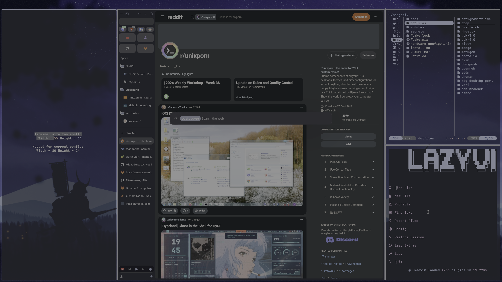

# mangoNix - NixOS & MangoWM Configuration

[](https://nixos.org)
[](https://github.com/mangowm/mango)
[](https://github.com/noctalia-dev/noctalia)
[](https://github.com/InioX/matugen)
[](LICENSE)

Personal NixOS and **MangoWM** configuration. It is built using modern Nix Flakes (`flake-parts`), `flake-aspects`, and `import-tree` for automatic module discovery, with dotfiles symlinked out-of-store using Home-Manager so configuration changes apply instantly without requiring a full system rebuild.

> **AI Assistance** - Portions of this NixOS configuration and its ongoing maintenance have been assisted by AI tools.

---

## 🎨 Theme & Styling

The desktop is designed around a modern, dynamic glassmorphic aesthetic:

* **Dynamic Colors with Matugen:** All system palettes (MangoWM borders, Ghostty, Kitty, Noctalia, Oh My Posh, SDDM, GTK) dynamically adapt to the active wallpaper using Material You color science.
* **Desktop Shell with Noctalia:** Fast, native Wayland desktop shell providing the top status panel, application launcher, control center, clipboard history, session controls, and built-in wallpaper & Wallhaven browser.
* **GTK & Icons:** Unified dark theming with `adw-gtk3-dark`, Papirus-Dark icons, and Breeze cursor theme.
* **Terminal Prompt:** Styled with **Oh My Posh** using a responsive Zen theme.
* **Spotify:** Themed seamlessly using **spicetify-nix**.

---

## 🎨 Desktop Showcase & Gallery

<p align="center">
  
  <br>
  <em><b>Figure 1:</b> MangoWM tiling layout featuring Zen Browser, Ghostty, Neovim, and the Noctalia shell panel.</em>
</p>

<details>
<summary><b>📸 Click to expand the full visual showcase</b></summary>

<br>

### 🌈 1. Dynamic Matugen Palette Sync
> Changing wallpapers dynamically re-themes MangoWM borders, Ghostty/Kitty terminals, Noctalia widgets, Oh My Posh, and Neovim in real-time (`SUPER + ALT + t`).

<p align="center">
  
</p>

---

### 🌌 2. Noctalia Shell & Custom Control Center
> Fast, native Wayland desktop shell providing app launcher, control center, clipboard history, and NordVPN controls.

<p align="center">
  
</p>

---

### ⌨️ 3. Built-In Cheat Sheet Overlays
> Access interactive keybindings (`SUPER + .`) and Neovim cheat sheets (`SUPER + ,`) instantly via Noctalia or Fuzzel modals.

<p align="center">
  
</p>

---

### ⚡ 4. Terminal Stack & Daily Rebuilds
> Powered by Yazi file manager, Ghostty GPU terminal, Oh My Posh Zen prompt, and `nh` NixOS rebuild helper (`fr`).

<p align="center">
  
</p>

---

### 🔒 5. SDDM Astronaut Display Manager
> Unified login experience with dynamic wallpaper syncing and Material You color accents.

<p align="center">
  
</p>

</details>

---

## 💻 Tech Stack & Specs

| Component | Software | Description |
|---|---|---|
| **OS** | NixOS (Unstable) | Pure declarative Linux system |
| **Compositor** | [MangoWM](https://github.com/mangowm/mango) | Dynamic Wayland tiling window manager (Scroller & Master-Stack) |
| **Desktop Shell** | [Noctalia](https://github.com/noctalia-dev/noctalia) | Wayland desktop shell, widgets, panel & launcher |
| **Theming Engine** | [Matugen](https://github.com/InioX/matugen) | Material You dynamic theme generator from wallpapers |
| **Terminals** | Ghostty & Kitty | GPU-accelerated Wayland terminal emulators |
| **Shell** | Zsh + Oh My Posh | Prompt styling with autosuggestions & syntax highlighting |
| **Browser** | Zen Browser | Privacy-focused, Arc-inspired Firefox fork |
| **File Managers** | Thunar & Yazi | GUI (XFCE) and fast terminal file managers |
| **Text Editors** | Kate / Neovim / Antigravity IDE | Graphical and terminal-based code editors |
| **Display Manager** | SDDM | Astronaut theme (purple_leaves) with dynamic wallpaper sync |
| **Audio** | PipeWire & WirePlumber | Low-latency audio server with Pavucontrol |
| **Graphics & Tuning** | AMDGPU + LACT | Mesa RADV Vulkan, HDR WSI, overdrive & fan control |
| **Rebuild Helper** | `nh` | Fast NixOS rebuild CLI with generation cleaner |

---

## 🛠️ How to Install (Fresh Install Guide)

You can bootstrap this configuration automatically using the interactive installer, or follow the manual steps below.

### Method A: Automated Interactive Installer (Recommended)

1. Boot into a fresh, standard installation of NixOS.
2. Open a terminal and run the interactive bootstrapper:

```bash
# Recommended one-liner (downloads and runs with interactive TTY):
bash -c "$(curl -fsSL https://raw.githubusercontent.com/Tiizzel/mangoNix/main/install.sh)"

# Or run directly via pipe:
curl -sL https://raw.githubusercontent.com/Tiizzel/mangoNix/main/install.sh | bash
```

Alternatively, clone the repository first and run it locally:

```bash
# If git is not yet installed on a minimal system, enter an ephemeral nix-shell:
nix-shell -p git

# Clone and launch installer:
git clone https://github.com/Tiizzel/mangoNix.git ~/mangoNix
cd ~/mangoNix
./install.sh
```

The installer will:
- Automatically bootstrap missing prerequisites (`git`, `pciutils`) in an ephemeral `nix-shell` if needed.
- Automatically detect your GPU (AMD, NVIDIA, Intel, VM, or Generic) via `lspci` and DRM hardware fallbacks.
- Prompt for your preferred username, display name, hostname, timezone, keyboard layout, and optional SOPS Age key.
- Set up your host configuration under `hosts/<hostname>/` (with `hardware-configuration.nix`, `host-packages.nix`, and `default.nix`).
- Declaratively update your user module options.
- Build and activate the system via Nix Flakes and prompt to reboot.

---

### Method B: Manual Installation

If you prefer to perform each step manually:

#### 1. Install NixOS
1. Boot from the official NixOS installer (graphical or minimal ISO).
2. Complete the standard installer steps and boot into your new installation.

#### 2. Clone the Repository
Open a terminal in your fresh install and clone this repository into your home directory:

```bash
# Start a temporary shell with git
nix-shell -p git

# Clone into ~/mangoNix (required path for dotfile symlinks)
git clone https://github.com/Tiizzel/mangoNix.git ~/mangoNix
# Alternatively, via GitLab: git clone https://gitlab.com/Tiizzel/mangonix.git ~/mangoNix
cd ~/mangoNix
```

#### 3. Setup Host & Copy Machine-Specific Hardware Configuration
Every machine has unique disk partition UUIDs, CPU microcode, and kernel modules. mangoNix organizes machine configurations into `hosts/<hostname>/`.

Create your host folder (e.g. `nixos`, or your machine's hostname) and copy the hardware configuration generated by your installer:

```bash
mkdir -p ~/mangoNix/hosts/nixos
cp /etc/nixos/hardware-configuration.nix ~/mangoNix/hosts/nixos/hardware-configuration.nix
```

You can customize packages specific to this machine in `hosts/nixos/host-packages.nix`, and configure user/system settings in `hosts/nixos/variables.nix`.

#### 4. Configure Host & User Variables

All customizable variables for this machine are defined in `hosts/nixos/variables.nix`:

```nix
{ config, ... }: {
  var = {
    username = "tiizzel";                                   # Primary user account name
    name = "Tiizzel";                                       # Display / full name
    hostname = "nixos";                                     # System hostname
    dotfilesDir = "/home/${config.var.username}/mangoNix";  # Dotfiles repository path
    timezone = "Europe/Berlin";                             # System timezone
    keyboardLayout = "de";                                  # Keyboard layout
    gpu = "amd";                                            # "amd" | "nvidia" | "intel" | "vm" | "generic"
    enableSops = true;                                      # Enable SOPS encrypted secrets management
  };
}
```

#### 5. Build and Apply Configuration

Run the initial rebuild with Flakes enabled (note: `nixos-rebuild` accepts `--option extra-experimental-features "nix-command flakes"`):

```bash
sudo nixos-rebuild switch --flake .#nixos --option extra-experimental-features "nix-command flakes"
```

#### 6. Reboot

```bash
reboot
```

Upon boot, SDDM will welcome you. Log in to launch MangoWM and the Noctalia shell!

---

## 🖥️ Multi-Host Management

mangoNix automatically discovers any host directory placed inside `hosts/` that contains a `default.nix`:

```
hosts/
├── nixos/                          # Primary workstation
│   ├── default.nix                 # Host entrypoint
│   ├── hardware-configuration.nix  # Workstation disk & CPU config
│   ├── host-packages.nix           # Workstation-specific packages
│   └── variables.nix               # Workstation host & user variables
└── laptop/                         # Optional second machine
    ├── default.nix
    ├── hardware-configuration.nix  # Laptop hardware config
    ├── host-packages.nix           # Laptop-specific packages (e.g. brightnessctl)
    └── variables.nix               # Laptop-specific variables (e.g. gpu = "intel")
```

To add a new machine:
1. Create `hosts/<hostname>/`
2. Place the machine's `hardware-configuration.nix`, `host-packages.nix`, `variables.nix`, and `default.nix` in that folder.
3. Switch with `nh os switch ~/mangoNix` or `sudo nixos-rebuild switch --flake .#<hostname>`.

---

## 📂 Repository Structure

The configuration follows a modular, dendritic structure discovered automatically via `import-tree`:

```
├── flake.nix                       # Flake entry point & input dependencies
├── flake.lock                      # Locked dependency versions
├── install.sh                      # Post-boot interactive system installer
├── README.md                       # System documentation
├── hosts/                          # Machine-specific host configurations
│   └── nixos/                      # Host definition for 'nixos'
│       ├── default.nix             # Host entrypoint
│       ├── hardware-configuration.nix # Target machine hardware configuration
│       └── host-packages.nix       # Host-specific package declarations
├── dotfiles/                       # Raw config files (symlinked out-of-store)
│   ├── antigravity-ide/            # IDE settings & keybindings
│   ├── btop/                       # System monitor theme & config
│   ├── fastfetch/                  # System info display config
│   ├── ghostty/                    # Ghostty terminal configuration
│   ├── gtk-3.0/ & gtk-4.0/         # Dark GTK styling & bookmarks
│   ├── kitty/                      # Kitty terminal configuration
│   ├── mango/                      # MangoWM config (keybinds, layout, rules)
│   ├── matugen/                    # Material You color templates & generator
│   ├── noctalia/                   # Noctalia shell, launcher & panel configs
│   ├── ohmyposh/                   # Zen shell prompt theme
│   ├── sddm/                       # SDDM login theme config
│   ├── thunar/                     # File manager preferences
│   ├── yazi/                       # Terminal file manager configuration
│   ├── zen-browser/                # Zen Browser userChrome, user.js & styles
│   └── zshrc/                      # User zshrc additions
└── modules/                        # Auto-discovered NixOS & Home Manager modules
    ├── hosts.nix                   # Host definition (nixosConfigurations.nixos)
    ├── apps/                       # User GUI applications (Vesktop, Spotify, etc.)
    ├── browsers/                   # Zen Browser flake module
    ├── chat/                       # Communication tools
    ├── cli-tools/                  # CLI utilities, nh, eza, bat, git
    ├── desktop-shells/             # Noctalia shell daemon and integration
    ├── editors/                    # Kate, Neovim
    ├── file-managers/              # Thunar & Yazi integration
    ├── gaming/                     # Steam, Gamemode, Gamescope
    ├── hardware/                   # Audio (PipeWire), Bluetooth, AMDGPU drivers, Wooting
    ├── login-managers/             # SDDM service configuration
    ├── sessions/                   # MangoWM compositor session module
    ├── system/                     # Core NixOS options, cachix, fonts, network, services, sops
    ├── terminal-shells/            # Zsh configuration, aliases, and shell functions
    ├── terminals/                  # Kitty & Ghostty installation
    ├── theming/                    # GTK themes, Papirus icons, Qt, Matugen hooks
    └── users/                      # User definitions & Home Manager binding
```

---

## ⌨️ Essential Keybindings

The primary modifier key is **`SUPER`** (the Windows key).

### 🚀 Applications
| Keybind | Action |
|---|---|
| `SUPER + t` | Open Ghostty terminal |
| `SUPER + SHIFT + t` | Open Kitty terminal |
| `SUPER + b` | Launch Zen Browser |
| `SUPER + f` | Open Thunar file manager |
| `SUPER + y` | Launch Yazi terminal file manager |
| `SUPER + z` | Launch Antigravity IDE |
| `SUPER + ALT + m` | Open Pavucontrol (Audio control) |

### 🪟 Window Management
| Keybind | Action |
|---|---|
| `SUPER + q` | Close focused window |
| `SUPER + SHIFT + f` | Toggle floating state |
| `SUPER + CTRL + f` | Toggle fullscreen |
| `SUPER + SHIFT + m` | Toggle maximize screen |
| `SUPER + SHIFT + i` | Cycle layout (Scroller, Center Tile, etc.) |
| `SUPER + [Arrow / HJKL]` | Move focus (Directional / Vim-style) |
| `SUPER + SHIFT + [Arrow / HJKL]` | Swap window position (Directional / Vim-style) |
| `SUPER + [1 - 9]` | Switch to workspace / tag 1 - 9 |
| `SUPER + SHIFT + [1 - 9]` | Move window to workspace / tag 1 - 9 |
| `SUPER + n` | Toggle scratchpad window |

### 🌌 Noctalia Shell & Widgets
| Keybind | Action |
|---|---|
| `SUPER + Space` | Application launcher |
| `SUPER + Tab` | Window switcher |
| `SUPER + x` | Power & session menu |
| `SUPER + v` | Clipboard manager |
| `SUPER + c` | Quick network panel |
| `SUPER + m` | Calendar & notification center |
| `SUPER + SHIFT + c` | Control center |
| `SUPER + SHIFT + w` | Wallpaper picker |
| `SUPER + CTRL + w` | Wallhaven wallpaper browser |
| `SUPER + d` | Toggle desktop dock |
| `SUPER + CTRL + l` | Lock screen |
| `SUPER + SHIFT + n` | Force night light toggle |
| `SUPER + ALT + t` | Re-run Matugen theme generator |

### 📸 Screenshots
| Keybind | Action |
|---|---|
| `SUPER + s` | Region screenshot |
| `SUPER + CTRL + s` | Fullscreen screenshot |
| `SUPER + SHIFT + s` | Screenshot and annotate |

### 📖 Cheat Sheets & Overlays
| Keybind | Action |
|---|---|
| `SUPER + .` | Interactive Keybindings modal (`SUPER + CTRL + .` for Fuzzel) |
| `SUPER + ,` | Interactive Neovim Cheat Sheet modal (`SUPER + CTRL + ,` for Fuzzel) |

---

## ⚡ Daily Workflow & Commands

Thanks to `nh` and pre-configured Zsh aliases:

| Command | Action |
|---|---|
| `fr` | Quick system rebuild (`nh os switch ~/mangoNix`) |
| `fu` | Rebuild and update flake inputs (`nh os switch --update ~/mangoNix`) |
| `fc` | Clean old Nix generations (`fc` prompts for generations to keep) |
| `v` | Launch Neovim |
| `z` | Launch Yazi file manager |
| `l` / `ll` / `la` | Modern `eza` directory listing with icons |
